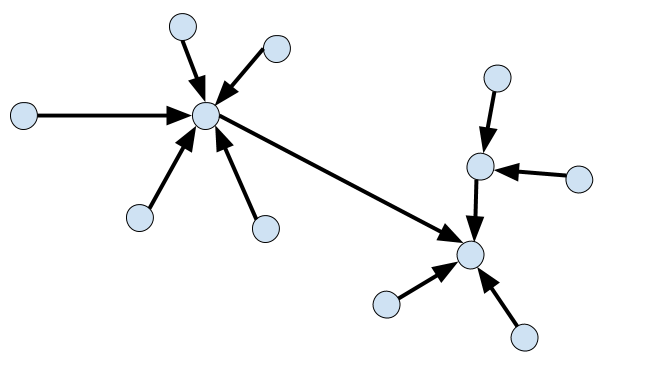

EspMesh

Implementación de la librería serial de software Arduino para el ESP8266
mas detalles en https://github.com/uagaviria/EspSoftwareSerial

Documentación técnica de EspMesh

EspMesh crea una red de auto-organización, donde todos los nodos están conectados. Todos los nodos en la malla son iguales. La red utiliza una topología en estrella, evitando rutas circulares. Los mensajes entre los diferentes nodos se envían en formato JSON, haciéndolos fáciles de entender y producir.

Información de enrutamiento

La información de enrutamiento se comparte en forma de mensajes de sincronización de nodos. Cada nodo informa a sus vecinos acerca de todos los otros nodos a los que está conectado directamente ya todas sus respectivas subconnexiones. De esta manera, cada nodo tiene una imagen en tiempo real de toda la malla y sabe qué nodos están conectados a la malla. Esta información se actualiza  cada 3 segundos aproximadamente.

Casos en los que se realiza una nueva sincronización de nodo:

-La petición de sub-conexiones se realiza periódicamente.

-Cuando se detecta cualquier actualización en la red, es decir,  cualquier subconección de un nodo ha cambiado.

-Cuando un nuevo nodo se conecta a un nuevo AP.

Mensajes de enrutamiento

Con la topología de red en estrella sin bucles. El enrutamiento se vuelve muy fácil. Hay una sola ruta para cada par de nodos.

Mensajes INDIVIDUAL (SINGLE) :

Para mensajes individuales, se especifica un nodo de destino y de origen. En primer lugar, la conexión a utilizar se busca. Ya sea la conexión directa, o la conexión que tiene una subconección con el nodo de destino. El mensaje se envía a ese nodo. Cuando ese nodo no es el nodo de destino, el mensaje exacto se transmite a la siguiente conexión, que se busca de la misma manera. Esto se repite hasta que el mensaje llega al nodo de destino.

Los mensajes no son reconocidos. Esto debe implementarse a nivel de aplicación.

Mensajes EMITIDOS - (BROADCAST):

Para los mensajes de difusión, todas las conexiones se iteran y el mensaje se envía a cada conexión. Al recibir el mensaje de difusión, el mensaje es retransmitido a todas las conexiones del nodo receptor, excepto la conexión por la que se recibe el mensaje.

